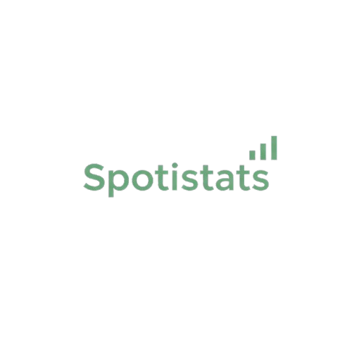

# Spotistats: Your Spotify Stats 🎵📊


Spotistats helps you track and analyze your Spotify listening habits, offering insights into your music preferences, top tracks, and artists. Discover your listening patterns, generate custom playlists, and dive deep into your Spotify activity with easy-to-understand visualizations. 🔍🎧

## Features ✨
- **Top Tracks & Artists** 🎶: View your most played tracks and artists over various time periods.
- **Listening Patterns** 📈: Analyze your listening behavior to understand trends and preferences.

## Tech Stack 🛠
-️ **React**: Frontend library for building user interfaces.
- **tailwindcss**: Utility-first CSS framework for rapid UI development.
- **bun**: fast JavaScript bundler|runtime|package manager.

## Getting Started 🚀

### Prerequisites 🔑

To get started with Spotistats, you need:
- A **Spotify account** 🎧.
- An **API Key** for Spotify. Follow the instructions on [Spotify Developer](https://developer.spotify.com/dashboard/) to create an app and get your credentials.
- **Node.js** and **npm** installed on your machine.

### Installation 🛠️

1. Clone the repository:

   ```bash
   git clone https://github.com/yourusername/spotistats.git
   cd spotistats
   ```

2. Install dependencies:

   ```bash
   bun install
   ```

3. Set up your Spotify credentials:

   - Create a `.env` file in the root of the project.
   - Add your Spotify credentials to the `.env` file:

     ```
     SPOTIFY_CLIENT_ID=your-client-id
     SPOTIFY_CLIENT_SECRET=your-client-secret
     SPOTIFY_REDIRECT_URI=your-redirect-uri
     ```

### Running the App 🏃‍♀️💻

To start Spotistats locally:

```bash
  bun dev
```

This will start the application, and you can begin exploring your Spotify stats. 🎶🔍


Made with ❤️ by [kijmoshi](http://kijmoshi.xyz)🚀